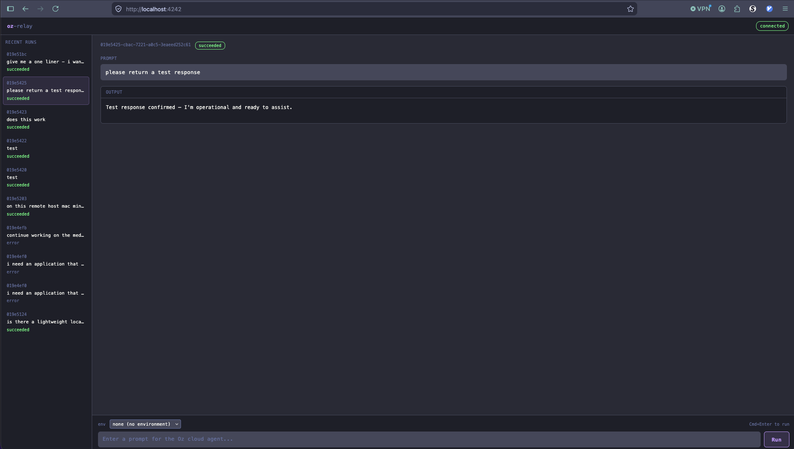

# oz-relay

A lightweight web UI for dispatching and monitoring [Warp](https://warp.dev) Oz cloud agents. Type a prompt, dispatch a run, and watch the agent output stream back in real time — from any browser, including mobile.



## Requirements

- macOS with [Warp](https://warp.dev) installed and signed in
- The `oz` CLI available (ships with Warp)
- Node.js 20+

## Setup

```sh
npm install
```

No API key required. Authentication uses your existing Warp session via the `oz` CLI.

## Usage

### Start the server

```sh
npm start
# → http://localhost:4242
```

For live reload during development:

```sh
npm run dev
```

### Using the UI

1. Open `http://localhost:4242` in a browser
2. Type a prompt in the input bar and press **Run** (or `Cmd+Enter`)
3. The run appears in the sidebar; the output panel streams the agent's response every 3 seconds until the run reaches a terminal state
4. Select any past run from the sidebar to inspect its output

The UI is **mobile-optimized** — the sidebar collapses to a slide-in drawer on small screens, inputs use 44px tap targets, and the layout respects iOS safe area insets.

## Configuration

Copy `.env.example` to `.env` to override defaults:

```sh
cp .env.example .env
```

```sh
# .env
PORT=4242
```

The port can also be set inline:

```sh
PORT=8080 npm start
```

## API

The server exposes a small REST + SSE API, all backed by the `oz` CLI.

| Method | Path | Description |
|---|---|---|
| `POST` | `/api/run` | Dispatch a new cloud agent run |
| `GET` | `/api/runs` | List recent runs |
| `GET` | `/api/run/:id` | Get run details + extracted output |
| `GET` | `/api/run/:id/events` | SSE stream — polls state + output every 3s until terminal |
| `DELETE` | `/api/run/:id` | Cancel a running agent |
| `GET` | `/api/environments` | List available Oz environments |

### POST /api/run

```json
{
  "prompt": "Summarize the open GitHub issues in this repo",
  "environment_id": "optional-env-id"
}
```

Returns `{ run_id, state, prompt }`.

### SSE events

Each event is a JSON object with at minimum:

```json
{
  "run_id": "uuid",
  "state": "in_progress",
  "output": "Assistant text accumulated so far...",
  "prompt": "original prompt",
  "session_link": "https://app.warp.dev/conversation/..."
}
```

Terminal states: `succeeded`, `failed`, `cancelled`, `errored`.

## File structure

```
oz-relay/
  server.js       # Express backend — proxies oz CLI, serves SSE
  public/
    index.html    # Single-page UI (Dracula theme, mobile-optimized)
  .env            # Local config — gitignored
  .env.example    # Template for .env
  package.json
```

## Authentication

oz-relay shells out to the local `oz` CLI, which uses your Warp session. No API key is embedded in the app. If you want to run the server without an active Warp GUI session (e.g. on a headless machine), set `WARP_API_KEY` in `.env` — the `oz` CLI will pick it up via the `WARP_API_KEY` environment variable.

## Running as a background service

A launchd plist is included for macOS auto-start:

```sh
launchctl load ~/Library/LaunchAgents/com.allie.oz-relay.plist
```

To stop:

```sh
launchctl unload ~/Library/LaunchAgents/com.allie.oz-relay.plist
```

Logs: `~/Library/Logs/oz-relay.log` / `~/Library/Logs/oz-relay.error.log`
